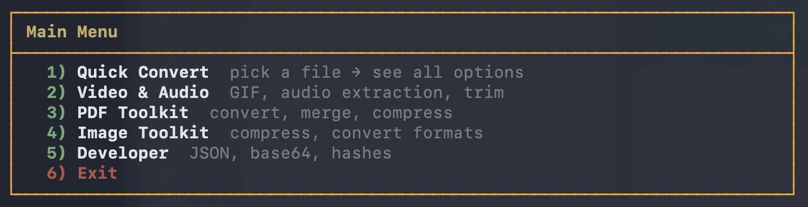
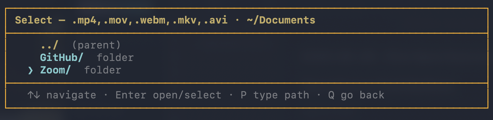
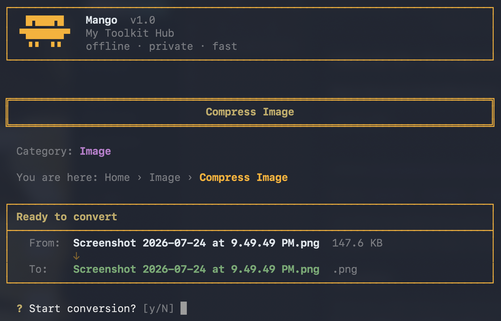
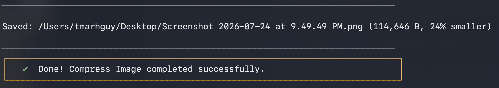

# Mango Tools


A polished, user-friendly **command-line utility collection** designed to house all my frequently used tools in one place. I am not the biggest fan of intrusive online converters with ads, paywalls, and network issues. Everything here runs cleanly and quickly right from the terminal.

<p align="center">
  
</p>


---

## Why this Repository?

**Consolidated Workflow.** Instead of relying on random websites to perform basic tasks like compressing an image, merging files, or converting a video to a GIF, I built this repository to act as a personal "Swiss Army Knife". 

**Polished Experience.** The terminal doesn't have to be boring. These tools are built with user experience in mind, providing clear progress feedback and a clean interface.

---

## Table of Contents

- [Why this Repository?](#why-this-repository)
- [The Mango UI](docs/mango-ui.md)
- [Available & Planned Tools](#available--planned-tools)
- [Installation & Setup](docs/install.md)
- [Author](#author)

---

## The Mango UI

Run `mango` anywhere to open the interactive hub — pick a category, browse folders, and let Mango guide the conversion. After `./setup.sh --link --yes`, all tools are available globally (`format-json`, `merge-pdf`, `to_gif`, etc.).

<p align="center">
  
</p>

The main menu uses arrow keys — no typing numbers. Pick a category and Mango walks you through the rest.

<br>

### Browse to your file

When a tool needs input, Mango doesn't dump you into an empty folder or throw an error. It shows only the subfolders that actually contain matching files, plus any matches in the current directory. Open folders with Enter, go back with `../`, or press **P** to type a path.

<p align="center">
  
</p>

<br>

### Preview, run, done

Before anything runs, you see exactly what goes in and what comes out. Confirm once, watch it execute, and get a clear result — saved path, file size, and how much space you saved.

<p align="center">
  
</p>

<p align="center">
  
</p>

<p align="center">
  
</p>

More detail: [docs/mango-ui.md](docs/mango-ui.md)


---

## Available & Planned Tools

This project is currently expanding into a comprehensive suite of offline tools divided by category.

**Setup:** See [docs/install.md](docs/install.md). Run `./setup.sh --link --yes` to use `mango`, `format-json`, and other tools from anywhere. Run `mango doctor` to verify dependencies.

### Video & Audio (`tools/video/` & `tools/audio/`)
- [x] **video-to-gif**: Two-pass ffmpeg palette conversion + gifsicle optimization for sharp, compact GIFs. (`bin/to_gif`) — `ffmpeg` required; `gifsicle` optional (auto-built on first run). Flags: `-w`, `--fps`, `-c` colors, `-l` lossy.
- [x] **extract-audio**: Pull MP3/WAV tracks from video files. (`bin/extract-audio`)
- [x] **trim-media**: Trim media duration with ffmpeg. (`bin/trim-media`)
- [x] **compress-video**: Shrink videos to Best / 80% / 50% / 25% / 10% of original size, with a recommendation and estimated output size for each. (`bin/compress-video`) — `ffmpeg` required. Flags: `--ratio`, `--list`.

### PDF Toolkit (`tools/pdf/`)
A complete offline alternative to tools like iLovePDF.
- **Manipulation:**
  - [x] `merge-pdf`: Combine PDFs in the order you want.
  - [x] `split-pdf`: Separate pages into independent PDF files.
  - [ ] `organize-pdf`: Sort, delete, or add pages to your document.
  - [x] `rotate-pdf`: Rotate your PDFs the way you need them.
  - [ ] `crop-pdf`: Crop margins or specific areas of PDF documents.
- **Conversion (From PDF):**
  - [x] `pdf-to-word`: Convert PDF into DOCX (text-based PDFs; scanned docs need OCR).
  - [ ] `pdf-to-excel`: Pull data straight from PDFs into Excel.
  - [ ] `pdf-to-ppt`: Turn PDFs into PPTX slideshows.
  - [x] `pdf-to-jpg`: Convert each PDF page into a JPG.
  - [ ] `pdf-to-md`: Turn PDFs into Markdown files for notes and LLMs.
- **Conversion (To PDF):**
  - [ ] `word-to-pdf`: Convert DOC/DOCX to PDF.
  - [ ] `excel-to-pdf`: Convert EXCEL to PDF.
  - [ ] `ppt-to-pdf`: Convert PPTX to PDF.
  - [x] `jpg-to-pdf`: Convert images to PDF.
  - [ ] `html-to-pdf`: Convert webpages to PDF via URL.
- **Optimization:**
  - [x] `compress-pdf`: Reduce file size (Ghostscript or pymupdf fallback).
  - [ ] `pdf-to-pdfa`: Transform to ISO-standardized PDF/A for archiving.
- **Security & Metadata:**
  - [x] `protect-pdf`: Encrypt PDF documents with passwords.
  - [x] `unlock-pdf`: Remove PDF password security.
  - [ ] `sign-pdf`: Request or apply electronic signatures.
  - [x] `watermark-pdf`: Stamp an image or text over your PDF.
  - [ ] `redact-pdf`: Permanently remove sensitive information.
- **Advanced / AI:**
  - [ ] `ocr-pdf`: Convert scanned PDF into searchable documents.
  - [ ] `summarize-pdf`: AI summarizer for articles and essays.
  - [ ] `translate-pdf`: Translate PDF files while keeping layout intact.
  - [ ] `repair-pdf`: Recover data from corrupt PDF files.
  - [ ] `pdf-forms`: Create and fill interactive forms.

### Image Toolkit (`tools/image/`)
- [x] **compress-image**: Compress JPEG, PNG, WebP, and GIF images locally.
- [x] **convert-image**: Convert between raster formats (jpg, png, webp, gif, bmp).
- [x] **strip-exif**: Remove metadata and EXIF data for privacy before sharing.

### Developer Utilities (`tools/dev/`)
- [ ] **merge-files**: Combine multiple files into single archives.
- [x] **format-json**: Pretty-print or minify JSON files.
- [x] **csv-to-json**: Rapid conversion of data tables to JSON arrays.
- [x] **base64-tool**: Encode and decode files or strings.
- [x] **hash-gen**: Generate MD5, SHA-1, and SHA-256 checksums.

---

## Installation & Setup

Full instructions: **[docs/install.md](docs/install.md)**

**One-liner** (installs to `~/.local/share/mango`, then runs offline):

```bash
curl -fsSL https://raw.githubusercontent.com/tmarhguy/tools/main/setup.sh | bash -s -- --yes --link
```

**Or clone + setup:**

```bash
git clone https://github.com/tmarhguy/tools.git && cd tools
./setup.sh
```

---

## Author

**Tyrone Marhguy** — Computer Engineering '28, [University of Pennsylvania](https://www.upenn.edu/)

Questions or collabs — reach out.

| | |
|---|---|
| Email | [tmarhguy@gmail.com](mailto:tmarhguy@gmail.com) · [tmarhguy@engineering.upenn.edu](mailto:tmarhguy@engineering.upenn.edu) |
| Twitter | [@marhguy_tyrone](https://twitter.com/marhguy_tyrone) |
| Instagram | [@tmarhguy](https://instagram.com/tmarhguy) |
| Substack | [@tmarhguy](https://substack.com/@tmarhguy) |
| GitHub | [@tmarhguy](https://github.com/tmarhguy) |


