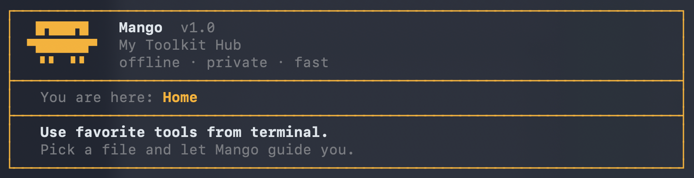
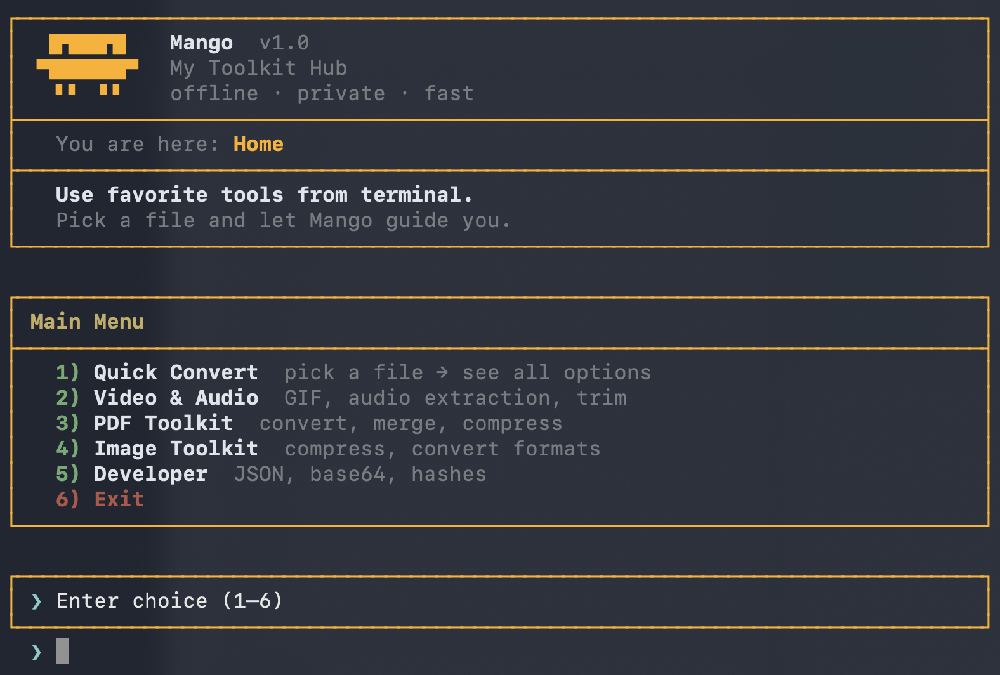

# Mango - The Interactive Terminal UI

As the toolkit expands, remembering individual script paths, names, and arguments becomes cumbersome. To solve this, I am introducing **Mango**—a centralized, interactive shell interface.

## Why "Mango"?
- **Cool Factor**: It's short, memorable, and fun.(PS: I don't even like mangoes, but apple is taken :)
- **Convenience**: Instead of calling various `tools/...` scripts with long paths, you simply type `mango` anywhere in your terminal.

## Core Features & Goals
- **Highly Interactive**: The UI should feel like a polished application, not a standard text dump. It will prompt for inputs step-by-step.
- **Zero Friction**: Accessible immediately from the terminal without worrying about long URLs, data paths, or flags.
- **Longevity**: Designed to be the permanent front-end for all future PDF, image, and video workflows.

## Execution Plan
1. **Build `bin/mango`**: A pure bash script (for maximum portability) featuring a stylized menu.
2. **Global Access**: Ensure the script is in the `$PATH` so it can be invoked globally.
3. **Seamless Tool Integration**: Dynamically map user choices to the underlying scripts in the `tools/` directory.

## Screenshots

Captured in [`media/`](../media/):

See also [docs/install.md](../docs/install.md) for setup and [docs/mango-ui.md](../docs/mango-ui.md) for the full interface guide.